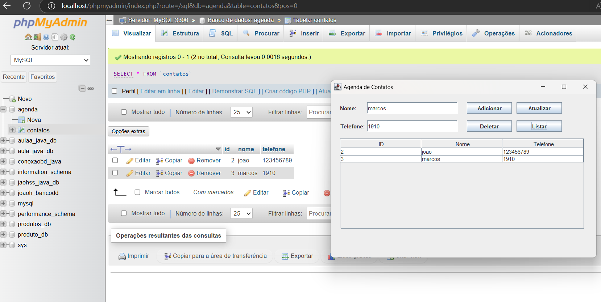
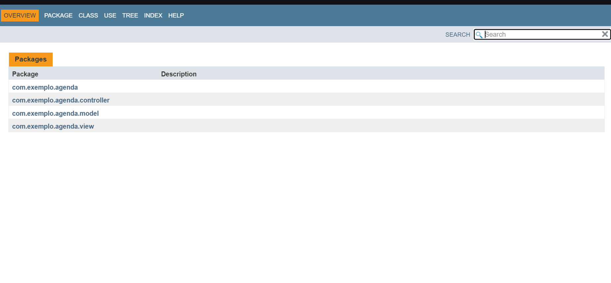

# Agenda Pessoal

Este programa se compõe de um sistema de gerenciamento de contatos por uma agenda, onde é possível adicionar, remover, modificar e listar pessoas com seus respectivos números de telefone dentro do banco de dados usando JPA, tudo isso é feito através de uma interface gráfica(GUI) que contém botões para as funções listadas anteriormente.
## 🚀 Começando

CRIE O PROJETO AGENDA PESSOAL;

REPRODUZA OS PASSOS MENCIONADOS NO CONTEÚDO DA AULA 13, INCLUSIVE OS COMENTÁRIOS DOS CÓDIGOS;

COMPILE O PROJETO E SE CERTIFIQUE QUE O MESMO ESTÁ EM FUNCIONAMENTO;

GERE O JAVADOC DO PROJETO;

POR FIM, ARMAZENE O PROJETO EM UM REPOSITÓRIO REMOTO;

MONTE SEU README.MD DO PROJETO E OS PASSOS PARA REPRODUÇÃO;

ENVIE O LINK DO SEU REPOSITÓRIO NA ATIVIDADE.
### 📋 Pré-requisitos

De que coisas você precisa para instalar o software e como instalá-lo?

```
.
```

### 🔧 Instalação

* Usuário precisa digitar o nome de alguma pessoas e seu número de telefone para ser adicionada, o usuário poderá modificar ou remover o produto de acordo com o iten selecionado na interface gráfica, também tem a opção de listar as pessoas presentes presentes na banco de dados.

## 🛠️ Construído com

Ferramentas utilizadas e bibliotecas

* VS CODE

## 📌 Versão

* **Versão 1.0** 

## ✒️ Autores

* **João Henrique Santos da Silva** - *Trabalho Inicial* - Agenda Pessoal

## GUI e DB
* **Banco de dados e GUI**




